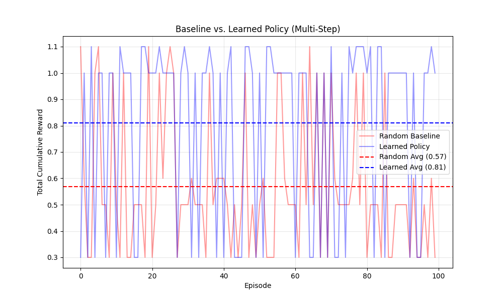

# LifeWeaver 🧬
### Adaptive Multi-Agent Life Simulator (AMALS)

**LifeWeaver** is a high-fidelity Reinforcement Learning (RL) environment designed to simulate real-world decision-making under uncertainty. It challenges agents to navigate the complex trade-offs between professional commitments and personal well-being through a multi-step, partially observable process.

---

## 🚩 The Problem
Traditional RL environments often focus on static, single-step decisions or deterministic outcomes. In reality, life is:
- **Sequential:** Decisions unfold over time.
- **Uncertain:** Success is not guaranteed; external factors (stress, travel) influence outcomes.
- **Dynamic:** Failures happen, and the ability to recover is as important as the initial plan.

## 💡 The Solution
LifeWeaver introduces a **3-Phase Episode** structure that forces agents to plan, execute, and adapt. It uses a sophisticated reward system that penalizes both failure and unnecessary over-correction, training agents to be efficient yet resilient.

---

## 🏗 Environment Design
The environment follows a rigorous **OpenEnv** architecture, structured into three distinct phases:

1.  **Planning Phase:** The agent selects an initial intent (`attend_meeting`, `attend_dinner`, or `balance_both`). This is logged via a simulated **Calendar MCP Server**.
2.  **Execution Phase:** The environment calculates a success probability influenced by the agent's `stress` and `travel_time`. The outcome is sampled as `success`, `partial`, or `failure`.
3.  **Recovery Phase:** If things go wrong, the agent must choose a recovery action (`reschedule`, `delay`, or `apologize`). 

**Note:** The environment is **Partially Observable**. The agent cannot see the outcome of its actions until the Execution Phase is complete, preventing information leakage and ensuring realistic training.

---

## 🚀 Key Features
- **Context-Aware Rewards:** Prioritizes outcomes based on randomized task importance (Low/Medium/High).
- **Uncertainty Engine:** Realistic stochasticity where high stress increases the chance of failure.
- **Adaptive Recovery:** Incentivizes intelligent mitigation over blind action.
- **MCP Integration:** Uses Model Context Protocol (MCP) simulations for tool-augmented decision making.

---

## 📊 Results
We compared a **Random Baseline** against a **Learned Policy** using an Exploration-Exploitation strategy over 200 episodes.

| Metric | Random Baseline | Learned Policy | Improvement |
| :--- | :--- | :--- | :--- |
| **Avg. Reward** | ~0.57 | **~0.81** | **+42.5%** |
| **Success Rate** | ~60% | **~85%** | **+25%** |
| **Recovery Efficiency** | Low | **High (Context-Based)** | Significant |

### Performance Visualization
The following graph demonstrates the agent's ability to converge on the optimal strategy by mastering both the initial planning and the necessary recovery steps.



---

## 🛠 Why This Matters
LifeWeaver serves as a bridge between abstract RL tasks and real-world AI assistants. By training models in environments that value **resilience** and **contextual reasoning**, we move closer to AI that can truly manage the complexities of human life.

---

## 💻 How to Run

### 1. Install Dependencies
```bash
pip install -r amals-env/requirements.txt
```

### 2. Verify Environment
```bash
python amals-env/test_multistep_env.py
```

### 3. Run Training & Comparison
```bash
python amals-env/train/train_multistep.py
python amals-env/train/compare_baseline.py
```

---

## 📁 Project Structure
```text
LifeWeaver/
├── amals-env/
│   ├── env/               # Core Environment (Logic, Rewards, Scenarios)
│   ├── mcp_local/         # Simulated MCP Tool Servers
│   ├── train/             # Training & Comparison Scripts
│   ├── openenv.yaml       # OpenEnv Specification
│   └── test_env.py        # Validation Suites
├── README.md              # Project Documentation
└── GEMINI.md              # AI Agent Instructions
```

---

## 🔮 Future Work
- **LLM Integration:** Using TRL/Unsloth to fine-tune LLMs on these trajectories.
- **Multi-Agent Support:** Simulating conflicts between multiple agents sharing resources.
- **Complex Tools:** Adding Email and Finance MCP servers for broader simulation.

## 🏁 Conclusion
LifeWeaver demonstrates that with the right environment design, agents can learn to handle not just success, but also the inevitable failures of a complex life. It is a robust foundation for building the next generation of adaptive, multi-agent simulators.

---

## 🔗 Links
- **Repository:** [GitHub](https://github.com/SivaPanyam/meta-openenv-LifeWeaver)
- **Documentation:** [Wiki](https://github.com/SivaPanyam/meta-openenv-LifeWeaver/wiki)
