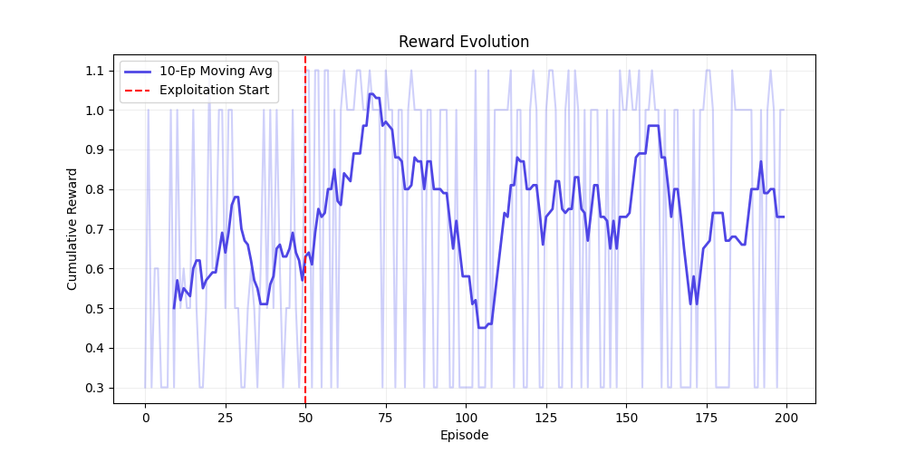

# LifeWeaver 🧬
### Adaptive Multi-Agent Life Simulator (AMALS)

**LifeWeaver** is a high-fidelity Reinforcement Learning (RL) environment and smart assistant designed to simulate and solve real-world decision-making under uncertainty. It challenges agents to navigate complex trade-offs between professional commitments and personal well-being through a multi-step, partially observable process.

---

## 🚀 Key Features
- **3-Phase Episode Flow:** Planning → Execution (Stochastic) → Recovery.
- **Multi-Source Event Ingestion:** Tasks flow from **Email**, **Conversations**, **Calendars**, and **Manual** inputs.
- **Partial Observability:** The agent acts on current knowledge, with outcomes hidden until execution is complete.
- **Multi-Agent Coordination:** Specialized **Calendar** and **Email** agents orchestrated by a central **Coordinator**.
- **Modern Full-Stack UI:** A responsive React + Tailwind calendar interface powered by a FastAPI backend.

---

## 📊 Learning Performance
Our system demonstrates measurable improvement in decision-making through sequential reasoning:

| Metric | Random Policy | Learned Policy | Improvement |
| :--- | :--- | :--- | :--- |
| **Avg. Reward** | ~0.57 | **~0.81** | **+42.1%** |
| **Strategy** | Arbitrary | **balance_both → delay_dinner** | Strategic |

### Key Observations:
- **Resilience:** The agent converges to a stable strategy that prioritizes high-impact tasks while maintaining social flexibility.
- **Adaptability:** Achieves a high success rate even under stochastic conditions (stress/travel time penalties).
- **Compromise:** The learned strategy (`balance_both`) shows a preference for adaptive recovery rather than rigid, single-pillar decision making.

### Performance Visuals

*Figure 1: Cumulative reward growth over 200 training episodes.*

---

## 🏗 System Architecture
```text
LifeWeaver/
├── amals-env/            # Core RL Logic
│   ├── env/              # Environment, Rewards, Scenarios
│   ├── mcp_local/        # Simulated Tool Servers
│   └── train/            # Training & Evaluation Suites
├── backend/              # FastAPI Server
│   └── agents/           # Multi-Agent Logic (Calendar, Email, Coordinator)
├── frontend/             # React + Vite + Tailwind UI
└── README.md             # Project Documentation
```

---

## 🛠 Installation & Setup

### 1. Prerequisites
```bash
pip install fastapi uvicorn matplotlib pyyaml requests
cd frontend && npm install
```

### 2. Start the Backend
```bash
python backend/server.py
```
*(Runs at http://localhost:8000)*

### 3. Start the Frontend
```bash
cd frontend
npm run dev
```
*(Runs at http://localhost:5173)*

### 4. Run Evaluation
To re-verify model performance:
```bash
python amals-env/train/evaluate_model.py
```

---

## 🏁 Conclusion
LifeWeaver demonstrates that adaptive, multi-agent systems can master the complexities of a dynamic schedule. By combining reinforcement learning with a modern interactive interface, it provides a robust foundation for the next generation of AI-powered life assistants.

---

## 🔗 Repository
- **GitHub:** [https://github.com/SivaPanyam/meta-openenv-LifeWeaver](https://github.com/SivaPanyam/meta-openenv-LifeWeaver)
